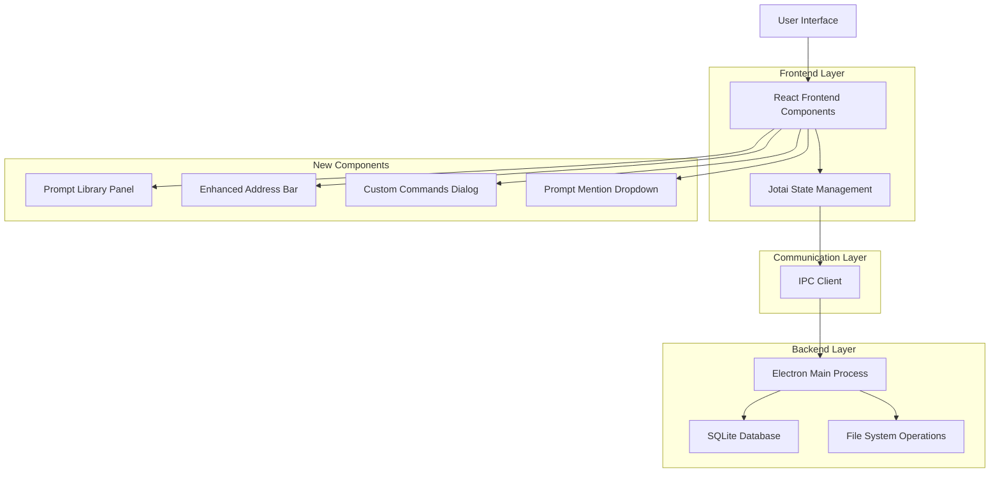

# Dyad v0.18.0 Beta 1 Features - Technical Architecture Document

## 1. Architecture Design

## 2. Technology Description

* **Frontend**: React\@18 + TypeScript + Jotai + TanStack Router + Tailwind CSS

* **Backend**: Electron Main Process + SQLite + Drizzle ORM

* **UI Components**: Radix UI + shadcn/ui + Lucide React Icons

* **Text Editor**: Lexical (Facebook's rich text editor)

* **Database**: SQLite with Drizzle ORM

* **State Management**: Jotai atoms

* **IPC**: Electron IPC with type-safe handlers

## 3. Route Definitions

| Route        | Purpose                       | New Components                                 |
| ------------ | ----------------------------- | ---------------------------------------------- |
| /home        | Home page with app creation   | Enhanced with prompt library access            |
| /chat        | Chat interface                | Enhanced LexicalChatInput with prompt mentions |
| /library     | New prompt library management | PromptLibraryPanel, PromptLibraryDialog        |
| /app-details | App details an                |                                                |

