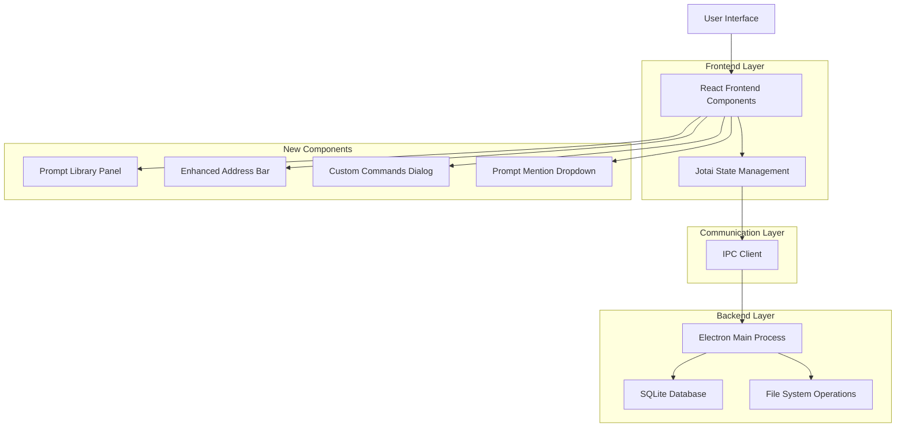
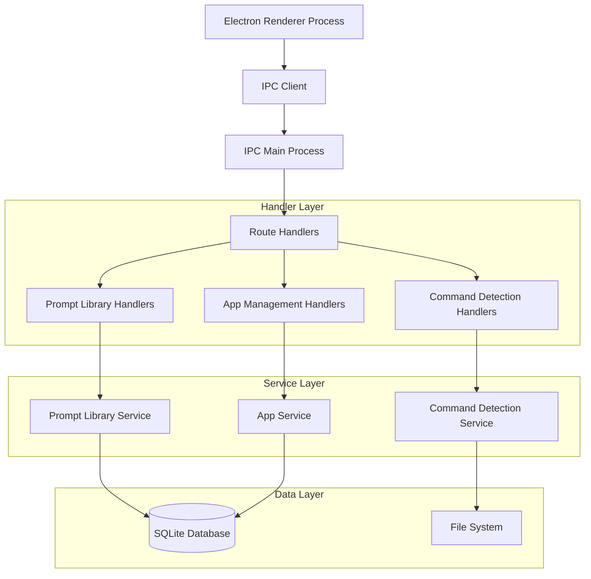
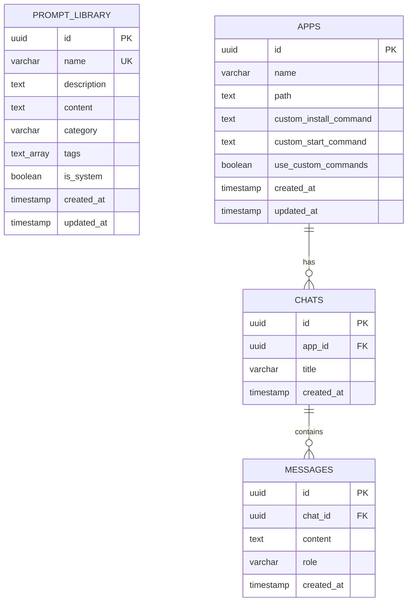

# Dyad v0.18.0 Beta 1 Features - Technical Architecture Document

## 1. Architecture Design



## 2. Technology Description

- **Frontend**: React@18 + TypeScript + Jotai + TanStack Router + Tailwind CSS
- **Backend**: Electron Main Process + SQLite + Drizzle ORM
- **UI Components**: Radix UI + shadcn/ui + Lucide React Icons
- **Text Editor**: Lexical (Facebook's rich text editor)
- **Database**: SQLite with Drizzle ORM
- **State Management**: Jotai atoms
- **IPC**: Electron IPC with type-safe handlers

## 3. Route Definitions

| Route | Purpose | New Components |
|-------|---------|----------------|
| /home | Home page with app creation | Enhanced with prompt library access |
| /chat | Chat interface | Enhanced LexicalChatInput with prompt mentions |
| /library | New prompt library management | PromptLibraryPanel, PromptLibraryDialog |
| /app-details | App details and preview | Enhanced PreviewIframe with better address bar |
| /settings | Settings and configuration | Custom commands configuration |

## 4. API Definitions

### 4.1 Prompt Library APIs

**Create Prompt**
```typescript
POST /api/prompt-library/create
```

Request:
| Param Name | Param Type | isRequired | Description |
|------------|------------|------------|-------------|
| name | string | true | Unique prompt name |
| description | string | false | Prompt description |
| content | string | true | Prompt content/template |
| category | string | false | Category (default: 'general') |
| tags | string[] | false | Array of tags |

Response:
| Param Name | Param Type | Description |
|------------|------------|-------------|
| success | boolean | Operation status |
| prompt | PromptLibraryEntry | Created prompt object |
| error | string | Error message if failed |

Example:
```json
{
  "name": "ui-guidelines",
  "description": "Standard UI component guidelines",
  "content": "Create a modern, accessible UI component following these guidelines: 1. Use semantic HTML, 2. Include proper ARIA labels, 3. Follow design system colors",
  "category": "ui",
  "tags": ["components", "accessibility", "design"]
}
```

**Get All Prompts**
```typescript
GET /api/prompt-library/list
```

Request:
| Param Name | Param Type | isRequired | Description |
|------------|------------|------------|-------------|
| category | string | false | Filter by category |
| search | string | false | Search in name/description |
| tags | string[] | false | Filter by tags |

Response:
| Param Name | Param Type | Description |
|------------|------------|-------------|
| prompts | PromptLibraryEntry[] | Array of prompts |
| total | number | Total count |

**Update Prompt**
```typescript
PUT /api/prompt-library/update
```

Request:
| Param Name | Param Type | isRequired | Description |
|------------|------------|------------|-------------|
| id | string | true | Prompt ID |
| name | string | false | Updated name |
| description | string | false | Updated description |
| content | string | false | Updated content |
| category | string | false | Updated category |
| tags | string[] | false | Updated tags |

**Delete Prompt**
```typescript
DELETE /api/prompt-library/delete
```

Request:
| Param Name | Param Type | isRequired | Description |
|------------|------------|------------|-------------|
| id | string | true | Prompt ID to delete |

### 4.2 Custom Commands APIs

**Update App Commands**
```typescript
PUT /api/apps/update-commands
```

Request:
| Param Name | Param Type | isRequired | Description |
|------------|------------|------------|-------------|
| appId | string | true | App ID |
| installCommand | string | false | Custom install command |
| startCommand | string | false | Custom start command |
| useCustomCommands | boolean | true | Whether to use custom commands |

**Detect Commands**
```typescript
POST /api/apps/detect-commands
```

Request:
| Param Name | Param Type | isRequired | Description |
|------------|------------|------------|-------------|
| appPath | string | true | Path to app directory |

Response:
| Param Name | Param Type | Description |
|------------|------------|-------------|
| detectedFramework | string | Detected framework type |
| suggestedInstall | string | Suggested install command |
| suggestedStart | string | Suggested start command |
| packageJsonScripts | object | Available npm scripts |

## 5. Server Architecture Diagram



## 6. Data Model

### 6.1 Data Model Definition



### 6.2 Data Definition Language

**Prompt Library Table**
```sql
-- Create prompt_library table
CREATE TABLE prompt_library (
    id UUID PRIMARY KEY DEFAULT gen_random_uuid(),
    name VARCHAR(100) UNIQUE NOT NULL,
    description TEXT,
    content TEXT NOT NULL,
    category VARCHAR(50) DEFAULT 'general',
    tags TEXT[] DEFAULT '{}',
    is_system BOOLEAN DEFAULT false,
    created_at TIMESTAMP WITH TIME ZONE DEFAULT NOW(),
    updated_at TIMESTAMP WITH TIME ZONE DEFAULT NOW()
);

-- Create indexes for performance
CREATE INDEX idx_prompt_library_name ON prompt_library(name);
CREATE INDEX idx_prompt_library_category ON prompt_library(category);
CREATE INDEX idx_prompt_library_tags ON prompt_library USING GIN(tags);
CREATE INDEX idx_prompt_library_created_at ON prompt_library(created_at DESC);

-- Insert default system prompts
INSERT INTO prompt_library (name, description, content, category, is_system, tags) VALUES
('ui-component-guidelines', 'Standard UI component creation guidelines', 'Create a modern, accessible UI component following these guidelines:\n1. Use semantic HTML elements\n2. Include proper ARIA labels and roles\n3. Follow the design system color palette\n4. Ensure responsive design\n5. Add hover and focus states\n6. Include TypeScript types\n7. Use Tailwind CSS for styling', 'ui', true, '{"components", "accessibility", "design", "typescript"}'),
('code-review-checklist', 'Comprehensive code review checklist', 'Please review this code for:\n1. Code quality and readability\n2. Performance optimizations\n3. Security vulnerabilities\n4. Error handling\n5. Test coverage\n6. Documentation\n7. Best practices adherence\n8. Potential bugs or edge cases', 'review', true, '{"review", "quality", "security", "testing"}'),
('api-endpoint-creation', 'REST API endpoint creation template', 'Create a REST API endpoint with:\n1. Proper HTTP methods and status codes\n2. Input validation and sanitization\n3. Error handling and meaningful error messages\n4. Authentication and authorization\n5. Rate limiting considerations\n6. Comprehensive documentation\n7. Unit and integration tests', 'api', true, '{"api", "backend", "validation", "testing"}'),
('database-optimization', 'Database query optimization guidelines', 'Optimize this database query/schema for:\n1. Query performance and indexing\n2. Data normalization\n3. Relationship integrity\n4. Scalability considerations\n5. Security (SQL injection prevention)\n6. Backup and recovery strategies\n7. Migration scripts', 'database', true, '{"database", "performance", "optimization", "security"}');
```

**Apps Table Enhancement**
```sql
-- Add custom commands columns to existing apps table
ALTER TABLE apps ADD COLUMN custom_install_command TEXT;
ALTER TABLE apps ADD COLUMN custom_start_command TEXT;
ALTER TABLE apps ADD COLUMN use_custom_commands BOOLEAN DEFAULT false;

-- Create index for apps with custom commands
CREATE INDEX idx_apps_custom_commands ON apps(use_custom_commands) WHERE use_custom_commands = true;
```

**TypeScript Type Definitions**
```typescript
// Core types for prompt library
export interface PromptLibraryEntry {
  id: string;
  name: string;
  description?: string;
  content: string;
  category: string;
  tags: string[];
  isSystem: boolean;
  createdAt: Date;
  updatedAt: Date;
}

export interface PromptMention {
  type: 'prompt' | 'app';
  name: string;
  content?: string;
  startIndex: number;
  endIndex: number;
}

export interface CustomCommands {
  installCommand?: string;
  startCommand?: string;
  useCustomCommands: boolean;
}

export interface CommandDetectionResult {
  detectedFramework: string;
  suggestedInstall: string;
  suggestedStart: string;
  packageJsonScripts: Record<string, string>;
  confidence: number;
}

// Enhanced app type
export interface AppWithCommands extends App {
  customInstallCommand?: string;
  customStartCommand?: string;
  useCustomCommands: boolean;
}
```

## 7. Component Architecture

### 7.1 Prompt Library Components

**PromptLibraryPanel.tsx**
```typescript
interface PromptLibraryPanelProps {
  onPromptSelect?: (prompt: PromptLibraryEntry) => void;
  mode?: 'standalone' | 'selector';
}

// Features:
// - Grid/list view toggle
// - Category filtering
// - Search functionality
// - Create/edit/delete operations
// - Import/export capabilities
// - Drag and drop reordering
```

**PromptMentionDropdown.tsx**
```typescript
interface PromptMentionDropdownProps {
  query: string;
  position: { x: number; y: number };
  onSelect: (prompt: PromptLibraryEntry) => void;
  onClose: () => void;
}

// Features:
// - Fuzzy search matching
// - Category grouping
// - Keyboard navigation
// - Preview on hover
// - Recent prompts priority
```

### 7.2 Enhanced Address Bar Components

**AddressBar.tsx**
```