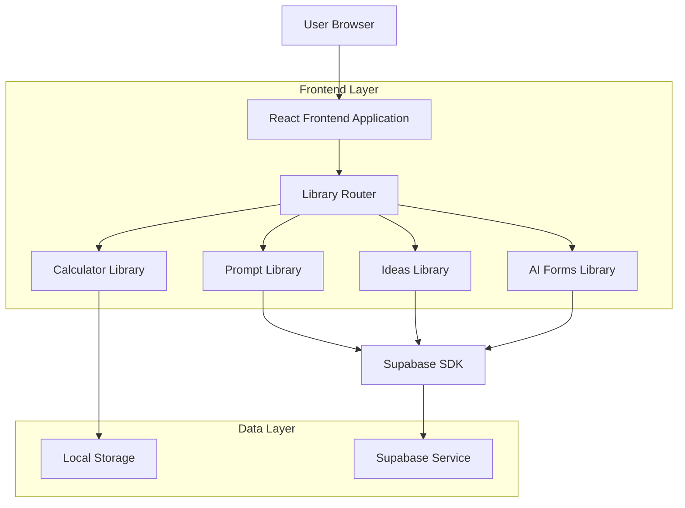
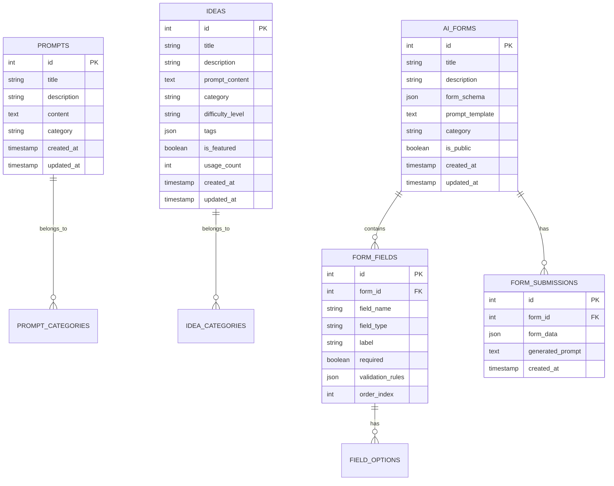

# Library Extension Architecture Document

## 1. Architecture Design



## 2. Technology Description

- Frontend: React@18 + TypeScript + TailwindCSS + Vite
- Backend: Supabase (PostgreSQL)
- Routing: TanStack Router
- State Management: Jotai
- UI Components: Shadcn/ui
- Icons: Lucide React

## 3. Route Definitions

| Route | Purpose |
|-------|----------|
| /library | Main library page with sub-navigation |
| /library/prompts | Prompt Library (existing functionality) |
| /library/ideas | Ideas Library with pre-loaded app ideas |
| /library/ai-forms | AI Forms Library for custom form creation |
| /library/calculators | Calculator Library with offline tools |
| /library/calculators/health | Health-related calculators |
| /library/calculators/finance | Finance-related calculators |

## 4. Component Architecture

### 4.1 Core Components

```
src/
├── app/
│   └── library/
│       ├── layout.tsx              # Library layout with sub-navigation
│       ├── page.tsx                # Main library landing page
│       ├── prompts/
│       │   └── page.tsx            # Existing prompt library
│       ├── ideas/
│       │   ├── page.tsx            # Ideas library main page
│       │   └── components/
│       │       ├── IdeaCard.tsx    # Individual idea card
│       │       └── IdeaDialog.tsx  # Idea details dialog
│       ├── ai-forms/
│       │   ├── page.tsx            # AI forms main page
│       │   └── components/
│       │       ├── FormBuilder.tsx # Form creation interface
│       │       ├── FormCard.tsx    # Form display card
│       │       └── FormRunner.tsx  # Form execution component
│       └── calculators/
│           ├── page.tsx            # Calculator categories
│           ├── health/
│           │   └── page.tsx        # Health calculators
│           ├── finance/
│           │   └── page.tsx        # Finance calculators
│           └── components/
│               └── CalculatorCard.tsx
├── components/
│   ├── LibraryNavigation.tsx       # Sub-navigation component
│   └── LibraryList.tsx             # Updated sidebar list
└── hooks/
    ├── useIdeas.ts                 # Ideas management hook
    ├── useAIForms.ts               # AI forms management hook
    └── useCalculators.ts           # Calculator utilities hook
```

### 4.2 Navigation Enhancement

Update the existing sidebar to show Library sub-items when Library is selected:

```typescript
// Enhanced AppSidebar with Library sub-navigation
type HoverState = 
  | "start-hover:app"
  | "start-hover:chat"
  | "start-hover:library"  // New library hover state
  | "start-hover:settings"
  | "clear-hover"
  | "no-hover";
```

## 5. Data Models

### 5.1 Data Model Definition



### 5.2 Data Definition Language

```sql
-- Ideas Table
CREATE TABLE ideas (
    id UUID PRIMARY KEY DEFAULT gen_random_uuid(),
    title VARCHAR(255) NOT NULL,
    description TEXT,
    prompt_content TEXT NOT NULL,
    category VARCHAR(100),
    difficulty_level VARCHAR(50) DEFAULT 'beginner',
    tags JSONB DEFAULT '[]',
    is_featured BOOLEAN DEFAULT false,
    usage_count INTEGER DEFAULT 0,
    created_at TIMESTAMP WITH TIME ZONE DEFAULT NOW(),
    updated_at TIMESTAMP WITH TIME ZONE DEFAULT NOW()
);

-- AI Forms Table
CREATE TABLE ai_forms (
    id UUID PRIMARY KEY DEFAULT gen_random_uuid(),
    title VARCHAR(255) NOT NULL,
    description TEXT,
    form_schema JSONB NOT NULL,
    prompt_template TEXT NOT NULL,
    category VARCHAR(100),
    is_public BOOLEAN DEFAULT true,
    created_at TIMESTAMP WITH TIME ZONE DEFAULT NOW(),
    updated_at TIMESTAMP WITH TIME ZONE DEFAULT NOW()
);

-- Form Fields Table
CREATE TABLE form_fields (
    id UUID PRIMARY KEY DEFAULT gen_random_uuid(),
    form_id UUID REFERENCES ai_forms(id) ON DELETE CASCADE,
    field_name VARCHAR(100) NOT NULL,
    field_type VARCHAR(50) NOT NULL,
    label VARCHAR(255) NOT NULL,
    required BOOLEAN DEFAULT false,
    validation_rules JSONB DEFAULT '{}',
    order_index INTEGER NOT NULL
);

-- Form Submissions Table
CREATE TABLE form_submissions (
    id UUID PRIMARY KEY DEFAULT gen_random_uuid(),
    form_id UUID REFERENCES ai_forms(id) ON DELETE CASCADE,
    form_data JSONB NOT NULL,
    generated_prompt TEXT NOT NULL,
    created_at TIMESTAMP WITH TIME ZONE DEFAULT NOW()
);

-- Indexes
CREATE INDEX idx_ideas_category ON ideas(category);
CREATE INDEX idx_ideas_featured ON ideas(is_featured);
CREATE INDEX idx_ideas_usage_count ON ideas(usage_count DESC);
CREATE INDEX idx_ai_forms_category ON ai_forms(category);
CREATE INDEX idx_form_fields_form_id ON form_fields(form_id, order_index);

-- Initial Ideas Data
INSERT INTO ideas (title, description, prompt_content, category, difficulty_level, tags, is_featured) VALUES
('TODO List App', 'A simple task management application', 'Create a comprehensive TODO list application with the following features: 1. Add, edit, and delete tasks 2. Mark tasks as complete/incomplete 3. Filter tasks by status 4. Search functionality 5. Categories or tags for tasks 6. Due dates and reminders 7. Priority levels 8. Responsive design 9. Local storage persistence 10. Clean and intuitive UI', 'Productivity', 'beginner', '["react", "javascript", "productivity"]', true),
('Landing Page', 'Modern responsive landing page', 'Design and develop a modern, conversion-focused landing page with: 1. Hero section with compelling headline 2. Features/benefits section 3. Social proof (testimonials, logos) 4. Call-to-action buttons 5. Contact form 6. Responsive design 7. Fast loading times 8. SEO optimization 9. Modern animations 10. Mobile-first approach', 'Marketing', 'intermediate', '["html", "css", "marketing"]', true),
('Music Discovery App', 'Discover new music based on preferences', 'Build a music discovery application featuring: 1. Music recommendation engine 2. Genre-based filtering 3. Artist and album search 4. Playlist creation 5. Favorite tracks system 6. Music player interface 7. Social sharing features 8. User profiles 9. Integration with music APIs 10. Responsive design', 'Entertainment', 'advanced', '["react", "api", "music"]', true);

-- Supabase RLS Policies
ALTER TABLE ideas ENABLE ROW LEVEL SECURITY;
ALTER TABLE ai_forms ENABLE ROW LEVEL SECURITY;
ALTER TABLE form_fields ENABLE ROW LEVEL SECURITY;
ALTER TABLE form_submissions ENABLE ROW LEVEL SECURITY;

-- Allow public read access to ideas and public forms
CREATE POLICY "Allow public read access to ideas" ON ideas FOR SELECT USING (true);
CREATE POLICY "Allow public read access to public forms" ON ai_forms FOR SELECT USING (is_public = true);

-- Allow authenticated users full access to their own data
CREATE POLICY "Allow authenticated users to manage forms" ON ai_forms FOR ALL USING (auth.role() = 'authenticated');
CREATE POLICY "Allow authenticated users to manage form fields" ON form_fields FOR ALL USING (auth.role() = 'authenticated');
CREATE POLICY "Allow authenticated users to manage submissions" ON form_submissions FOR ALL USING (auth.role() = 'authenticated');
```

## 6. Implementation Phases

### Phase 1: Navigation & Routing Enhancement
- Update AppSidebar to support Library sub-navigation
- Create new route structure for library sub-pages
- Implement LibraryLayout component with sub-navigation
- Update existing library route to use new layout

### Phase 2: Ideas Library
- Create Ideas data model and database tables
- Implement Ideas Library page with search and filtering
- Add pre-loaded app ideas (100+ items)
- Integrate with chat functionality for prompt pasting
- Add usage tracking and featured ideas

### Phase 3: AI Forms Library
- Design AI Forms data model and schema
- Create form builder interface
- Implement form runner component
- Add prompt template system with variable substitution
- Create form sharing and management features

### Phase 4: Calculator Library
- Design calculator categories and structure
- Implement offline calculator components
- Create Health calculators (BMI, BMR, body fat, etc.)
- Create Finance calculators (loan, mortgage, investment, etc.)
- Add calculator history and favorites

### Phase 5: Integration & Polish
- Integrate all libraries with main chat system
- Add cross-library search functionality
- Implement user preferences and customization
- Add analytics and usage tracking
- Performance optimization and testing

## 7. Key Features

### 7.1 Ideas Library Features
- **Pre-loaded Content**: 100+ app ideas across categories
- **Smart Search**: Search by title, description, tags, difficulty
- **Category Filtering**: Productivity, Entertainment, Business, etc.
- **Difficulty Levels**: Beginner, Intermediate, Advanced
- **Usage Tracking**: Track popular ideas
- **One-Click Integration**: Paste prompts directly to chat
- **Favorites System**: Save preferred ideas

### 7.2 AI Forms Library Features
- **Visual Form Builder**: Drag-and-drop interface
- **Field Types**: Text, number, select, checkbox, textarea
- **Validation Rules**: Required fields, patterns, ranges
- **Prompt Templates**: Dynamic prompt generation
- **Form Sharing**: Public/private form sharing
- **Submission History**: Track form usage

### 7.3 Calculator Library Features
- **Offline Functionality**: No internet required
- **Category Organization**: Health, Finance, General
- **Calculation History**: Save and review calculations
- **Export Results**: Share or save calculations
- **Responsive Design**: Mobile-optimized interfaces

## 8. User Experience Flow

1. **Library Access**: User clicks Library in sidebar
2. **Sub-Navigation**: Hover shows 4 sub-categories
3. **Category Selection**: Click navigates to specific library
4. **Content Interaction**: 
   - Ideas: Browse, search, click to paste to chat
   - AI Forms: Create, fill, generate prompts
   - Calculators: Select tool, input values, get results
   - Prompts: Existing functionality enhanced
5. **Integration**: Seamless flow back to chat with generated content

This architecture provides a scalable foundation for the extended Library functionality while maintaining the existing user experience patterns and technical stack.