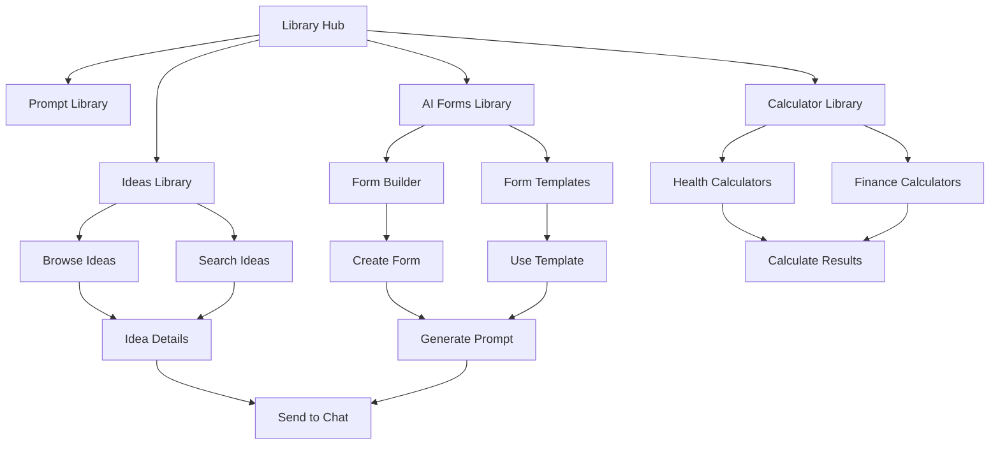

# Library Extension Product Requirements Document

## 1. Product Overview

Extend the existing Applaa Library functionality from a single Prompt Library to a comprehensive multi-library system with four distinct categories: Prompt Library, Ideas Library, AI Forms Library, and Calculator Library. This enhancement transforms the underutilized sidebar space into a powerful productivity hub that seamlessly integrates with the chat system.

The expanded Library will serve as a central repository for reusable templates, app ideas, dynamic forms, and utility calculators, significantly improving user productivity and engagement within the Applaa ecosystem.

## 2. Core Features

### 2.1 User Roles

| Role | Registration Method | Core Permissions |
|------|---------------------|------------------|
| Guest User | No registration required | Can browse Ideas Library and use Calculator Library |
| Authenticated User | Email registration | Full access to all libraries, can create/edit prompts and AI forms |
| Premium User | Subscription upgrade | Advanced features, unlimited form submissions, priority support |

### 2.2 Feature Module

Our enhanced Library system consists of the following main pages:

1. **Library Hub**: Main landing page with overview cards for each sub-library and quick access navigation.
2. **Prompt Library**: Enhanced existing functionality with improved search, categories, and management features.
3. **Ideas Library**: Curated collection of 100+ app ideas with extensive prompts that integrate directly with chat.
4. **AI Forms Library**: Dynamic form builder for creating custom input forms that generate structured prompts.
5. **Calculator Library**: Offline calculation tools organized by categories (Health, Finance, General).
6. **Health Calculators**: BMI, BMR, body fat percentage, calorie needs, and fitness-related calculations.
7. **Finance Calculators**: Loan calculators, mortgage payments, investment returns, and financial planning tools.

### 2.3 Page Details

| Page Name | Module Name | Feature Description |
|-----------|-------------|--------------------|
| Library Hub | Navigation Overview | Display four library categories with usage statistics, recent items, and quick access buttons |
| Library Hub | Search Global | Universal search across all libraries with filtered results by category |
| Prompt Library | Enhanced Management | Existing functionality with improved UI, bulk operations, and advanced filtering |
| Prompt Library | Category System | Organized categorization with custom tags and smart suggestions |
| Ideas Library | App Ideas Catalog | Browse 100+ pre-loaded app ideas with difficulty levels, categories, and popularity rankings |
| Ideas Library | Idea Details | Detailed view with full prompt content, implementation tips, and related technologies |
| Ideas Library | Chat Integration | One-click prompt insertion into chat with customizable parameters |
| Ideas Library | Usage Analytics | Track popular ideas, user favorites, and usage patterns |
| AI Forms Library | Form Builder | Visual drag-and-drop interface for creating custom forms with various field types |
| AI Forms Library | Template System | Dynamic prompt generation using form inputs with variable substitution |
| AI Forms Library | Form Management | Create, edit, duplicate, and share forms with version control |
| AI Forms Library | Submission History | Track form usage and generated prompts with export capabilities |
| Calculator Library | Category Navigation | Organized access to Health, Finance, and General calculator categories |
| Calculator Library | Calculation History | Save, review, and export calculation results with timestamps |
| Health Calculators | BMI Calculator | Body Mass Index calculation with health recommendations |
| Health Calculators | BMR Calculator | Basal Metabolic Rate calculation with activity level adjustments |
| Health Calculators | Body Fat Calculator | Body fat percentage estimation using multiple measurement methods |
| Finance Calculators | Loan Calculator | Monthly payment calculations with amortization schedules |
| Finance Calculators | Investment Calculator | Compound interest and investment growth projections |
| Finance Calculators | Mortgage Calculator | Home loan calculations with taxes and insurance |

## 3. Core Process

### Main User Flow

1. **Library Access**: User clicks Library icon in sidebar, triggering hover expansion to show four sub-categories
2. **Category Selection**: User selects desired library (Prompts, Ideas, AI Forms, or Calculators)
3. **Content Interaction**: User browses, searches, or creates content within the selected library
4. **Integration**: Generated content (prompts, forms, calculations) can be used directly or integrated with chat
5. **Management**: Users can save, organize, and manage their library content across sessions

### Ideas Library Flow

1. User navigates to Ideas Library
2. Browse featured ideas or search by category/difficulty
3. Click on idea to view detailed prompt and implementation guidance
4. One-click integration sends extensive prompt to chat for immediate use
5. System tracks usage for popularity rankings and recommendations

### AI Forms Flow

1. User accesses AI Forms Library
2. Choose to create new form or use existing template
3. Build form using visual editor with various field types
4. Define prompt template with variable placeholders
5. Save and share form for reuse
6. Fill form to generate structured prompts for LLM interaction

## 4. User Interface Design

### 4.1 Design Style

- **Primary Colors**: Blue gradient (#3B82F6 to #1D4ED8) for primary actions, maintaining brand consistency
- **Secondary Colors**: Gray scale (#F8FAFC to #1E293B) for backgrounds and neutral elements
- **Accent Colors**: Green (#10B981) for success states, Red (#EF4444) for destructive actions, Amber (#F59E0B) for warnings
- **Button Style**: Rounded corners (8px), subtle shadows, gradient backgrounds for primary actions
- **Typography**: Inter font family, 16px base size, clear hierarchy with 24px/32px/48px headings
- **Layout Style**: Card-based design with consistent 24px spacing, responsive grid layouts
- **Icons**: Lucide React icons with 20px standard size, consistent stroke width
- **Animations**: Subtle hover effects, smooth transitions (200ms), loading states with spinners

### 4.2 Page Design Overview

| Page Name | Module Name | UI Elements |
|-----------|-------------|-------------|
| Library Hub | Navigation Cards | Four large cards with icons, titles, descriptions, and usage stats. Gradient backgrounds with hover effects |
| Library Hub | Global Search | Prominent search bar with real-time suggestions and category filters |
| Ideas Library | Idea Grid | Responsive card grid with image placeholders, difficulty badges, category tags, and usage indicators |
| Ideas Library | Filters Panel | Sidebar with category checkboxes, difficulty sliders, and tag selection |
| Ideas Library | Idea Modal | Full-screen overlay with detailed content, code examples, and integration buttons |
| AI Forms Library | Form Builder | Split-screen layout with component palette on left, canvas in center, properties panel on right |
| AI Forms Library | Form Cards | Grid layout with form previews, usage statistics, and quick action buttons |
| Calculator Library | Category Tiles | Large tiles for each calculator category with representative icons and descriptions |
| Calculator Library | Calculator Interface | Clean input forms with real-time calculations and result displays |
| Health Calculators | Input Forms | Structured forms with unit selectors, validation, and health recommendations |
| Finance Calculators | Calculation Results | Tables and charts showing payment schedules, growth projections, and summaries |

### 4.3 Responsiveness

The application is designed with a desktop-first approach but includes comprehensive mobile adaptations:

- **Desktop (1024px+)**: Full sidebar navigation with hover expansion, multi-column layouts, and detailed information panels
- **Tablet (768px-1023px)**: Collapsible sidebar, two-column grids, and touch-optimized interactions
- **Mobile (320px-767px)**: Bottom navigation, single-column layouts, and swipe gestures for navigation
- **Touch Optimization**: Larger touch targets (44px minimum), swipe gestures, and mobile-specific interactions
- **Performance**: Lazy loading for large lists, optimized images, and efficient re-rendering

## 5. Detailed Feature Specifications

### 5.1 Ideas Library Features

- **Content Volume**: 100+ pre-loaded app ideas across 10+ categories
- **Categorization**: Productivity, Entertainment, Business, Education, Health, Finance, Social, Utilities, Games, Creative
- **Difficulty Levels**: Beginner (basic functionality), Intermediate (moderate complexity), Advanced (complex features)
- **Search Capabilities**: Full-text search across titles, descriptions, and tags with auto-suggestions
- **Filtering Options**: Multiple category selection, difficulty range, popularity sorting, recent additions
- **Integration Features**: One-click prompt insertion, customizable parameters, chat history integration
- **Analytics**: Usage tracking, popularity rankings, user favorites, and recommendation engine

### 5.2 AI Forms Library Features

- **Form Builder**: Visual drag-and-drop interface with real-time preview
- **Field Types**: Text input, textarea, number input, select dropdown, checkbox, radio buttons, file upload
- **Validation Rules**: Required fields, pattern matching, min/max values, custom validation messages
- **Prompt Templates**: Dynamic template system with variable substitution using {{fieldName}} syntax
- **Form Sharing**: Public/private sharing with unique URLs and embed codes
- **Version Control**: Form versioning with change tracking and rollback capabilities
- **Submission Management**: Form response collection, export to CSV/JSON, and analytics dashboard

### 5.3 Calculator Library Features

- **Health Calculators**: BMI, BMR, Body Fat %, Daily Calorie Needs, Ideal Weight, Heart Rate Zones
- **Finance Calculators**: Loan Payment, Mortgage, Investment Growth, Retirement Planning, Tax Calculator
- **General Calculators**: Unit Converter, Percentage Calculator, Date Calculator, GPA Calculator
- **Offline Functionality**: All calculations performed client-side without internet dependency
- **History Management**: Save calculation results with timestamps and custom labels
- **Export Options**: PDF reports, CSV data export, and shareable result links
- **Customization**: User preferences for units, currency, and default values

## 6. Success Metrics

- **User Engagement**: 40% increase in Library section usage within 3 months
- **Content Utilization**: 60% of users interact with Ideas Library monthly
- **Form Creation**: 25% of active users create at least one AI form
- **Calculator Usage**: 30% of users utilize Calculator Library weekly
- **Chat Integration**: 50% increase in prompt-based chat interactions
- **User Retention**: 20% improvement in monthly active user retention
- **Feature Adoption**: 80% of users explore at least 3 of the 4 library categories

This comprehensive Library extension will transform Applaa from a simple chat interface into a powerful productivity platform that serves diverse user needs while maintaining the intuitive, modern design that users expect.