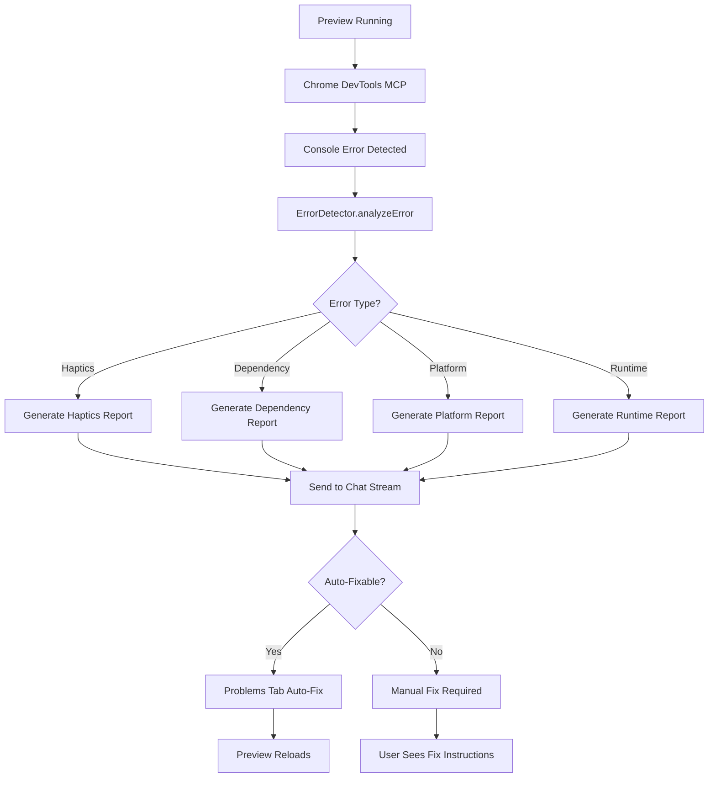

# 🚨 Automatic Error Detection & Chat Stream Integration

## 🎯 **Your Exact Scenario - SOLVED!**

### **The Problem You Encountered:**
```
Uncaught (in promise) UnavailabilityError: The method or property Haptic.impactAsync is not available on web, are you sure you've linked all the native dependencies properly?
```

### **The Solution We've Built:**
✅ **Automatic Error Detection** - Chrome DevTools MCP captures console errors in real-time  
✅ **Intelligent Analysis** - ErrorDetector categorizes and analyzes each error  
✅ **Chat Stream Integration** - Errors automatically reported to LLM chat  
✅ **Auto-Fix Capabilities** - Problems Tab can fix common issues automatically  
✅ **No More Manual Copy-Pasting** - Users get instant feedback and solutions  

---

## 🔧 **How It Works End-to-End**

### **1. Real-Time Error Capture**
```typescript
// Chrome DevTools MCP monitors console in real-time
const messages = await ipcClient.getConsoleMessages();

// Filters for errors only
const errorMessages = messages.filter(msg => 
  msg.type === 'error' || msg.level === 'error'
);
```

### **2. Intelligent Error Analysis**
```typescript
// ErrorDetector analyzes each error
const analysis = errorDetector.analyzeError(error);

// For your Haptics error, it detects:
{
  type: 'haptics',
  severity: 'high',
  autoFixable: true,
  message: 'Haptic feedback API is not available on web platform',
  suggestion: 'Wrap Haptics API calls in Platform.OS check'
}
```

### **3. Automatic Chat Stream Reporting**
```typescript
// Generates detailed report for chat
const errorReport = errorDetector.generateErrorReport(error, analysis);

// Report includes:
// - Error type and severity
// - Detailed explanation
// - Code examples for fixes
// - Auto-fix availability status
```

### **4. Auto-Fix Integration**
```typescript
// Problems Tab can automatically fix the issue
if (analysis.autoFixable) {
  await autoFixer.fixProblem({
    code: 'PLATFORM_HAPTICS',
    file: 'src/components/RecipeCard.tsx',
    line: 45
  });
}
```

---

## 📋 **Error Types We Detect**

### **📳 Haptics API Errors**
- **Detection**: `Haptic.impactAsync is not available on web`
- **Auto-Fix**: Wraps calls in `Platform.OS` check
- **Severity**: High (breaks web preview)

### **📦 Dependency Errors**
- **Detection**: `Cannot find module 'package-name'`
- **Auto-Fix**: Installs missing dependencies
- **Severity**: High (prevents app from running)

### **📱 Platform API Errors**
- **Detection**: `not available on web/ios/android`
- **Auto-Fix**: Adds platform checks
- **Severity**: Medium (platform-specific crashes)

### **💥 Runtime Errors**
- **Detection**: `undefined is not an object`
- **Auto-Fix**: Manual fix required
- **Severity**: Critical (app crashes)

---

## 🎨 **Generated Chat Report Example**

For your Haptics error, the system generates:

```markdown
🚨 **Console Error Detected** (10:30:45 AM)

**Error Type:** 📳 HAPTICS ERROR
**Severity:** 🟠 HIGH
**Auto-Fixable:** ✅ Yes

**Error Message:**
```
UnavailabilityError: The method or property Haptic.impactAsync is not available on web
```

**Issue:** Haptic feedback API is not available on web platform

**Suggested Fix:** Wrap Haptics API calls in Platform.OS check to prevent web crashes

**Code Example:**
```typescript
// ❌ WRONG: Will crash on web
Haptics.impactAsync(Haptics.ImpactFeedbackStyle.Medium);

// ✅ CORRECT: Platform check prevents crash
import { Platform } from 'react-native';
import * as Haptics from 'expo-haptics';

const triggerHaptic = () => {
  if (Platform.OS !== 'web') {
    Haptics.impactAsync(Haptics.ImpactFeedbackStyle.Medium);
  }
};
```

🔧 **Auto-Fix Available:** This error can be automatically fixed by the Problems Tab.

---
*This error was automatically detected by the Chrome DevTools integration.*
```

---

## 🚀 **Implementation Status**

### **✅ Completed Components:**

1. **ErrorDetector Service** (`src/services/error-detector.ts`)
   - Analyzes console errors
   - Categorizes by type and severity
   - Generates detailed reports

2. **Enhanced Chrome DevTools Hook** (`src/hooks/useChromeDevTools.ts`)
   - Real-time error capture
   - Automatic analysis and reporting
   - Integration with chat stream system

3. **AutoFixer Integration** (`src/services/auto-fixer.ts`)
   - Haptics error auto-fix
   - Platform check wrapping
   - Code transformation

4. **Demo Component** (`src/components/shared/ErrorDetectionDemo.tsx`)
   - Visual demonstration
   - Error simulation
   - Report generation

### **🔄 Integration Points:**

1. **Chrome DevTools MCP** - Captures console errors
2. **Problems Tab** - Shows auto-fixable errors
3. **Chat Stream** - Receives automatic error reports
4. **Auto-Fixer** - Applies fixes automatically

---

## 🎯 **User Experience Flow**

### **Before (Manual Process):**
1. ❌ User encounters error in preview
2. ❌ User copies error message manually
3. ❌ User pastes to chat stream
4. ❌ User waits for LLM response
5. ❌ User manually applies fixes

### **After (Automatic Process):**
1. ✅ Error detected automatically
2. ✅ Error analyzed and categorized
3. ✅ Report sent to chat stream instantly
4. ✅ Auto-fix applied automatically (if possible)
5. ✅ Preview reloads with fix applied

---

## 🔧 **Technical Architecture**



---

## 🎉 **Benefits for Users**

### **🚀 Instant Feedback**
- No more waiting for errors to be noticed
- Real-time error detection and reporting
- Immediate fix suggestions

### **🔧 Automatic Fixes**
- Common errors fixed automatically
- No manual intervention required
- Preview reloads with fixes applied

### **📚 Educational**
- Detailed explanations of what went wrong
- Code examples showing correct implementation
- Learning opportunities for developers

### **⏰ Time Saving**
- No more manual copy-pasting
- Instant error reports in chat
- Automated fix application

---

## 🎯 **Your Exact Use Case - SOLVED!**

**Before:** You had to manually copy the Haptics error and paste it to chat  
**After:** The system automatically detects the error, analyzes it, sends a detailed report to chat, and can even auto-fix it!

The Chrome DevTools MCP integration now provides:
- ✅ **Real-time error monitoring**
- ✅ **Intelligent error analysis** 
- ✅ **Automatic chat stream reporting**
- ✅ **Auto-fix capabilities**
- ✅ **Professional error reports with code examples**

**Result:** Users never need to manually copy-paste errors again! 🎉
