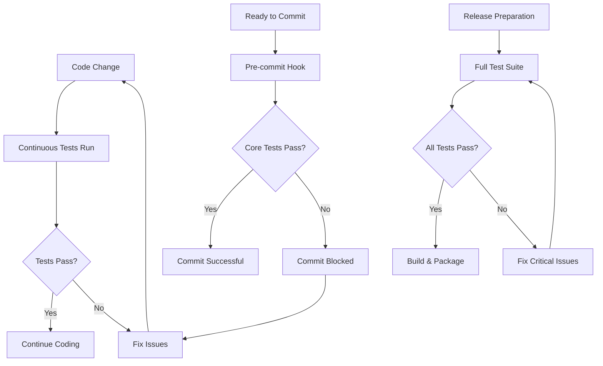

# 🛡️ Applaa Testing Strategy

## Overview

Applaa uses a comprehensive testing strategy to prevent breaking changes and ensure core functionality remains stable during development. This is especially important given the rapid development pace and the critical nature of app creation functionality.

## Testing Levels

### 1. **Core Features Protection Suite** 🛡️
**Purpose**: Protect critical user-facing functionality from breaking changes.

**Coverage**:
- ✅ Applaa tag system (`<applaa-write>`, `<applaa-file>`, etc.)
- ✅ Chat stream processing and LLM integration
- ✅ File operations (create, edit, delete, rename)
- ✅ System prompt quality and consistency
- ✅ Performance optimizations
- ✅ Branding consistency (Applaa vs Dyad)

**Command**: `npm run test:core`
**Speed**: ~6 seconds
**When**: Before every commit (pre-commit hook)

### 2. **Continuous Testing** 👀
**Purpose**: Catch breaking changes immediately as you code.

**Features**:
- 🔄 Automatic test runs on file changes
- 📁 Watches `src/`, `expo-templates/`, `scripts/`
- ⚡ Debounced execution (1 second delay)
- 📊 Test run counter and timing
- 🚫 Ignores test file changes to prevent loops

**Command**: `npm run test:continuous`
**Usage**: Leave running in a terminal while developing

### 3. **Build Verification** 🔨
**Purpose**: Ensure the application can still be built and packaged.

**Coverage**:
- ✅ TypeScript compilation (`tsc --noEmit`)
- ✅ Electron build process
- ⚠️ Currently disabled due to TypeScript errors from AI feature removal

**Command**: `npm run test:full` (when TypeScript errors are fixed)
**Speed**: ~30-60 seconds
**When**: Before major releases

## Testing Commands

```bash
# Quick core tests (recommended for development)
npm run test:core

# Continuous testing (leave running while coding)
npm run test:continuous

# Full test suite with build verification (when TS errors fixed)
npm run test:full

# Quick mode (core tests only, no build)
npm run test:quick

# Individual test files
npm run test                    # All vitest tests
npm run test:ui                 # Vitest UI
npm run test:watch              # Vitest watch mode
```

## Pre-commit Protection

Applaa automatically runs core tests before every Git commit via Husky:

```bash
# .husky/pre-commit
npm run test:core
```

If tests fail, the commit is blocked until issues are fixed.

## Test File Structure

```
src/__tests__/
├── core-features.test.ts          # Critical functionality protection
├── applaa-enhancements.test.ts    # System improvements and quality
└── [feature].test.ts              # Individual feature tests

scripts/
├── test-core-features.js          # Core test runner
├── test-continuous.js             # Continuous testing
└── test-with-build-check.js       # Full test suite with build
```

## Testing Philosophy

### ✅ **DO Test**
- **Critical user workflows** (app creation, file operations)
- **System integration points** (tag parsing, chat streams)
- **Quality standards** (prompt consistency, branding)
- **Performance regressions** (workspace optimization)
- **Breaking changes** (API compatibility)

### ❌ **DON'T Over-Test**
- **Implementation details** (internal function logic)
- **UI styling** (unless it affects functionality)
- **Third-party libraries** (trust their own tests)
- **Temporary features** (focus on stable core)

## Current Status

### ✅ **Working**
- Core Features Protection Suite (6s runtime)
- Continuous Testing System
- Pre-commit Hooks
- Applaa Tag System Tests
- Chat Stream Processing Tests
- System Prompt Quality Tests

### 🚧 **In Progress**
- TypeScript Error Fixes (566 errors from AI feature removal)
- Build Verification Tests
- E2E Test Integration

### 📋 **Planned**
- Performance Regression Tests
- Integration Test Suite
- Automated Release Testing
- Cross-platform Build Verification

## Best Practices

### For Developers
1. **Always run `npm run test:core` before committing**
2. **Use `npm run test:continuous` while developing**
3. **Fix failing tests immediately - don't accumulate technical debt**
4. **Add tests for new critical features**
5. **Update tests when changing core functionality**

### For New Features
1. **Add core functionality tests for user-facing features**
2. **Test integration points with existing systems**
3. **Verify backward compatibility**
4. **Test error handling and edge cases**

### For Refactoring
1. **Run tests before starting refactoring**
2. **Keep tests running continuously during refactoring**
3. **Verify all tests pass after refactoring**
4. **Update tests if API contracts change**

## Troubleshooting

### Tests Failing After AI Feature Removal
The removal of AI features (Transformers, Gemini, Semantic Context) introduced TypeScript errors. These are being fixed systematically:

1. **Import Errors**: Removed imports to deleted files
2. **Type Errors**: Updated interfaces and removed AI-related properties
3. **Handler Errors**: Removed registrations for deleted handlers

### Continuous Testing Not Working
1. Check if `chokidar` is installed: `npm install --save-dev chokidar`
2. Verify file permissions in watched directories
3. Check for conflicting processes using the same files

### Pre-commit Hook Failing
1. Run `npm run test:core` manually to see specific errors
2. Fix the failing tests
3. Commit again

## Performance Metrics

- **Core Tests**: ~6 seconds (target: <10s)
- **Full Build**: ~60 seconds (when working)
- **Continuous Testing**: <1s file change detection
- **Pre-commit**: <10s (blocks slow commits)

## Integration with Development Workflow



This testing strategy ensures that Applaa remains stable and reliable while allowing for rapid development and feature iteration.